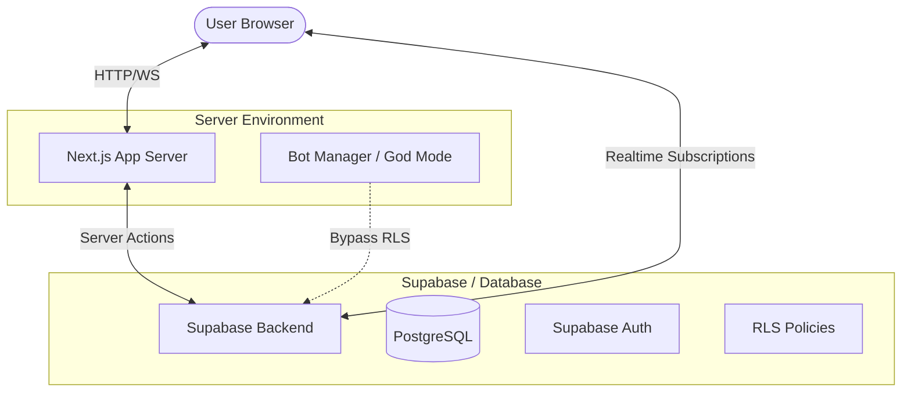

# Project Overview: Real-time Voting Application

This document provides a high-level overview of the application's architecture, data flow, and specialized systems as of the commencement of **Phase 6**.

## 🏛️ High-Level Architecture

The application is built on **Next.js 16 (App Router)** and **Supabase**, utilizing a serverless architecture with real-time capabilities.

## 🔄 Core Data Flow

### 1. Voting Flow
1. **Initiation**: User clicks a vote option in `PollCard`.
2. **Server Action**: The `submitVote` action (in `lib/actions/polls.ts`) is called.
3. **Database Insertion**: Record added to the `votes` table.
4. **Realtime Broadcast**: Supabase broadcasts the change to all subscribed clients.
5. **UI Update**: `useRealtimeVotes` (hooks) or `PageClient` (real-time listener) detects the change and triggers a soft refresh (`router.refresh()`).

### 2. Live Activity Feed
- **Subscribed Component**: `ActivityFeed.tsx` maintains a separate Realtime channel for the `votes` table.
- **Enriched Data**: The component fetches `profile` and `poll` details for each new vote event to display a human-readable stream.

## ⚡ Specialized Systems

### 1. "God Mode" Bot Simulation
The system allows for administrative control of "bot" users to simulate activity.
- **Permission Level**: Uses the **Service Role Key**, granting absolute bypass of Row Level Security (RLS).
- **Core Logic**: Centralized in `lib/admin/bot-manager.ts`.
- **Humanization**: Includes randomized delays (0.5s - 2s) and shuffled voting sequences to prevent predictable database spikes.

### 2. Real-time Presence
Managed via `useEnhancedRealtimePresence.ts`.
- **Deduplication & Batching**: Handles large user counts by batching profile fetches (chunks of 30) to avoid URL legacy limits.
- **Persistent Bots**: Simulation bots are factored into the online count displayed in `OnlineUsersBanner`.

## 📊 Database Schema Summary

| Table | Purpose | RLS Policy |
| :--- | :--- | :--- |
| `profiles` | User metadata (usernames, emails) | Viewable by all; Modified by owner |
| `polls` | Poll questions and creators | Viewable by all; Owned by creator |
| `polls_choices` | Multi-choice options for polls | Viewable by all; Inextricable from poll |
| `votes` | User selections | Viewable by all; One per user/poll |

## 🛠️ Global UI Layout
- **AppLayout**: Persistent wrapper containing the `Header`, `ActivityFeed` (sidebar), and `OnlineUsersBanner`.
- **PageClient**: State-aware container for home/dashboard views, managing real-time statistics and diagnostic tools.

## 🔮 Phase 6: Advanced Analytics & Management (Active)

Building upon the robust real-time foundation, Phase 6 focuses on deepening user insights and administrative control.

### 1. Data Visualization
- **Recharts Integration**: Implementation of responsive charts for poll results.
- **Collapsible Analytics**: Compact "at-a-glance" summary bars on the main poll cards.
- **Engagement Metrics**: Visualizing voting patterns and peak activity times.

### 2. Advanced Management
- **User Roles**: Implementing Admin, Moderator, and User tiers for granular permission control.
- **Poll Constraints**: Adding temporal logic (start/end dates) and visibility toggles.
- **Social Integration**: Real-time comment threads and sharing capabilities.

---

*Last Updated: December 17, 2025*
